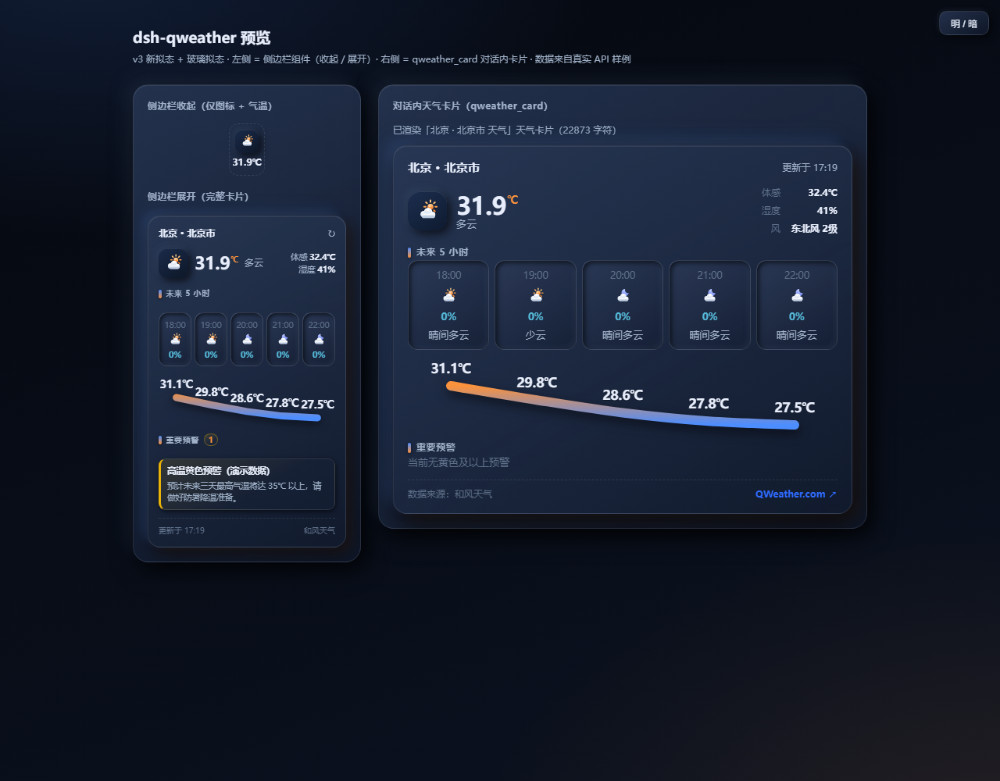
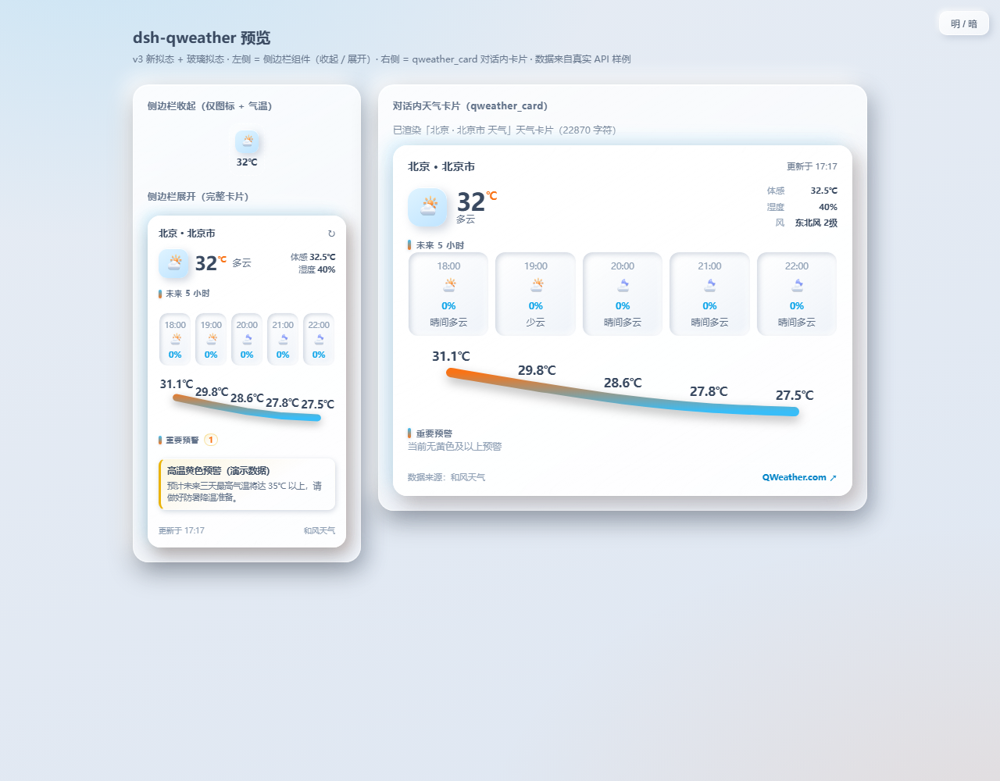

# dsh-qweather

DeepSeek Harness 的和风天气（QWeather）插件：把实时天气带进侧边栏、带给 LLM、画进对话流。注意：该工具非和风天气官方工具，仅采用了和风天气API

[](LICENSE) [](https://github.com/topics/dsh-plugin)

> **GitHub Topic：请为本仓库添加 `dsh-plugin`**（Repo → ⚙️ Settings → Topics → 输入 `dsh-plugin`）。这样插件会被 [dsh-plugin 主题](https://github.com/topics/dsh-plugin) 与 [awesome-dsh-plugin](https://github.com/awesome-dsh-plugin/awesome-dsh-plugin) 收录。

[English](README.en.md) · [UI 预览](preview.html) · [图标全集](icons.html) · [API 文档](https://dev.qweather.com/docs/api/) · [变更日志](CHANGELOG.md)

## 功能总览

| # | 功能 | 说明 |
| --- | --- | --- |
| 1 | **设置卡片** | 设置 → 插件 → 和风天气：填写 API Host / API KEY / 项目 ID、一键总开关、自动定位（市/区级）或手动位置，附「测试连接」 |
| 2 | **侧边栏天气组件** | 侧边栏底部（`sidebar.footer.action`）：展开显示当前天气（图标+文字）、气温、未来 5 小时逐时（气温/降水概率/风向风级）、蓝色以上预警、空气质量/日月起落/生活指数、更新时间；收起只显示天气图标 + 气温，点击展开侧边栏 |
| 3 | **LLM 天气接口** | 工具 `qweather_weather(location?, range?, hours?, days?, fields?)`：按“位置 + 时间区间 + 关心的信息”自动选择对应 API 取数，返回结构化摘要给模型作答 |
| 4 | **对话内天气卡片** | 工具 `qweather_card(location?)`：把当前天气、固定未来 5 小时逐时（气温/降水概率/风向风级）、蓝色以上预警、空气质量/日月起落/生活指数、更新时间画成交互式 HTML 卡片直接渲染进会话流（可回放） |

全部功能受设置卡片的**总开关**一键控制；关闭后侧边栏组件隐藏、两个工具返回明确提示（带错误码）。

UI 视觉风格参考 [uupm.cc/demo/investment-platform](https://uupm.cc/demo/investment-platform)（Vestia 金融面板）：深色卡片 + 细描边 + 16px 圆角 + 品牌色渐变曲线 + tabular 数字，并完整适配 DSH 明暗主题。

| 深色（默认） | 浅色 |
| --- | --- |
|  |  |

## 快速预览

- **静态预览**：直接双击打开仓库里的 [preview.html](preview.html)（自包含、默认深色、含明暗切换；样例数据来自真实 API；`preview.html?light` 直达浅色）。
- **图标全集**：双击打开 [icons.html](icons.html)——63 枚天气图标的完整图鉴（含夜间小时格嵌套演示），验证图标设计首选。
- **动态预览**：克隆本仓库 → `pnpm install && pnpm run check` → 装进一个临时 profile 并启动 Web 界面，打开 设置 → 插件 → 和风天气 填入你的 KEY 即可实时体验。

## 安装

```bash
# 从 GitHub 安装到 web profile（构建产物已提交，无需本地构建）
dsh plugin --profile web add github:youngforblbl/dsh-qweather

# 本地开发安装（修改源码后需重新构建）
cd dsh-qweather
dsh plugin --profile web add .
```

安装后**重启 `dsh web`（或刷新页面）**。桌面版：

```bash
dsh plugin --profile desktop add github:youngforblbl/dsh-qweather
# 重启 DSH Desktop 后生效
```

验证是否进入最终配置：

```bash
dsh --profile web --dump-config | grep -A2 qweather
```

## 配置

1. 登录 [QWeather 控制台](https://console.qweather.com)：
   - **API KEY**：控制台 → 项目和凭据 → API KEY（必需）；
   - **项目 ID**：同上（可选，仅记录，为后续 JWT 认证预留）；
   - **API Host**：控制台 → 设置 → API Host（可选）。留空默认使用公共域名 `https://devapi.qweather.com`（旧公共域名将从 2026 年起逐步停止服务，建议填入你的专属 Host，形如 `abc1234xyz.def.qweatherapi.com`）。
2. 打开 DSH → 设置 → 插件 → 和风天气，填入上述信息并「保存」；先点「测试连接」确认可用。
3. 位置：
   - **自动定位（市/区级）**：侧边栏组件用浏览器定位拿经纬度，经 GeoAPI 反查最近市/区并写回设置，LLM 工具直接复用；首次需允许定位权限，失败自动回退到手动位置；
   - **手动输入**：支持城市/区县名、LocationID（如 `101010100`）或“经度,纬度”（如 `116.41,39.92`）。

> 密钥与配置保存在本机 DSH 设置文件（`~/.dsh/settings.yaml`）中，请勿把该文件提交到任何仓库。和风 API 面向浏览器的跨域（CORS）已由官方开放，无需额外配置；数据标注“数据来源：和风天气”，符合其[注明来源](https://dev.qweather.com/docs/terms/attribution/)要求。

## 使用

### 侧边栏组件

展开侧边栏即可看到底部天气卡片：地点、当前天气（图标+文字+气温+体感/湿度）、未来 5 小时（时间/图标/气温/降水概率+雨滴/风向箭头+风级）、蓝色及以上预警（最多 2 条）、空气质量/日月起落/生活指数、更新时间；右上角 ↻ 手动刷新，数据每 10 分钟自动刷新。收起侧边栏只剩图标 + 气温，点击即可展开。

### 对 LLM 说

```text
北京现在天气怎么样？                              # 模型会调 qweather_weather
上海未来 5 小时会下雨吗？                          # range=hours
把杭州天气画成卡片给我看                            # 模型会调 qweather_card
广州明天适不适合跑步？（看温度、降水、空气质量）        # fields=temp,precipitation,air
```

两个工具的参数（模型通过内置 `qweather` 技能了解这些约定）：

- `qweather_weather`：`location`（缺省用设置位置）、`range=now|hours|days`、`hours=1-240`、`days=1-10`、`fields=condition,temp,humidity,wind,precipitation,air,warnings,astro`（`all` 或默认 `summary`）。
- `qweather_card`：`location`（缺省用设置位置）。卡片固定渲染未来 5 小时（布局按 5 列硬编码）。

### 卡片内容

当前天气（图标+文字+气温）→ 未来 5 小时逐时（气温/降水概率+雨滴/风向箭头+风级）→ 蓝色及以上预警（仅过滤未知级别）→ 空气质量/日月起落/生活指数 → 信息更新时间 + 数据来源。卡片随 DSH 明暗主题切换，会话重放时逐字节还原，不依赖网络。

## 错误码

所有对外错误（工具抛错、配置接口响应）都携带一个稳定的 `QW_*` 错误码。日志与告警按码检索，自动重试按 `retryable` 判定。

| 错误码 | 分类 | 可重试 | 说明 / 处理 |
| --- | --- | --- | --- |
| `QW_DISABLED` | config | 否 | 总开关已关闭：设置 → 插件 → 和风天气 打开 |
| `QW_NO_API_KEY` | config | 否 | 未配置 API KEY：设置 → 插件 → 和风天气 填写 |
| `QW_NO_LOCATION` | input | 否 | 未指定位置：传入 `location` 或配置默认位置 |
| `QW_LOCATION_NOT_FOUND` | input | 否 | 城市搜索无结果：换更精确写法 / LocationID / 经纬度 |
| `QW_GEOCODE_UNAVAILABLE` | config | 否 | 浏览器定位不可用：改用手动位置 |
| `QW_BAD_HOST` | config | 否 | API Host 非法：应为 http(s) 开头的域名 |
| `QW_NETWORK` | network | 是 | 本地网络失败 |
| `QW_TIMEOUT` | network | 是 | 请求超时 |
| `QW_CANCELLED` | network | 否 | 请求被调用方取消 |
| `QW_HTTP_ERROR` | upstream | 是 | 上游返回非 2xx HTTP 状态 |
| `QW_UPSTREAM_ERROR` | upstream | 否 | 上游返回业务错误码（GeoAPI envelope） |
| `QW_BAD_RESPONSE` | upstream | 是 | 上游响应无法解析为 JSON |
| `QW_BAD_REQUEST` | input | 否 | 配置请求体不合法 / 超限 / 校验失败 |
| `QW_FORBIDDEN` | permission | 否 | 跨源写配置被拒绝 |
| `QW_SETTINGS_UNAVAILABLE` | internal | 否 | 设置服务不可用，无法保存 |
| `QW_INTERNAL` | internal | 否 | 插件内部错误，看日志 |

错误码的权威目录在 `src/qweather/errors.ts` 的 `ERROR_CATALOG`（分类 / 可重试性 / 提示都在一处维护）。

## 日志与可观测性

插件内置轻量日志器（`src/qweather/log.ts`），零依赖、node/browser 共用：

- **分级**：`debug | info | warn | error | silent`；默认 `warn`（正常运行静默，只打印问题）。
- **开关**：环境变量 `QW_LOG_LEVEL=debug` 打开全部日志；`silent` 全部关闭。
- **命名空间**：日志行带前缀，便于按模块过滤——`[qweather:api]`（HTTP 请求与耗时）、`[qweather:tools]`（工具执行）、`[qweather:config]`（配置读写）。
- **脱敏**：所有结构化附加数据先经 `redact()`，`apiKey` / `token` / `secret` 等敏感字段一律替换为 `[redacted]`，密钥不会落日志。

排查示例：

```bash
# 命令行启动并打印全部日志
QW_LOG_LEVEL=debug dsh web

# 桌面版：在启动 DSH Desktop 前于同一终端设置
# PowerShell:  $env:QW_LOG_LEVEL = 'debug'
# bash:        export QW_LOG_LEVEL=debug
```

## 架构

```text
src/
├─ index.ts             node 半端入口：设置命名空间 + 两个工具 + qweather 技能
├─ tools.ts             工具定义（参数 schema / 输出投影 / 并发安全标记 / 错误码 / 日志）
├─ skill.ts             内置技能 provider（assets/qweather-skill.md）
├─ config-routes.ts     同源配置接口 GET/POST /dsh-qweather/config（错误码 + 日志）
├─ qweather/            三端共享的纯模块（node / browser / vitest）
│  ├─ types.ts          数据类型 + 预警过滤 + 标签/转义等纯函数
│  ├─ icons.ts          自绘内联 SVG 天气图标（无网络依赖，MIT）
│  ├─ api.ts            QWeatherClient：Weather API v1 + GeoAPI v2 + 旧域名回退
│  ├─ errors.ts         统一错误模型：QW_* 错误码 + 分类 + 可重试性 + 提示
│  ├─ log.ts            分级日志 + 命名空间 + 密钥脱敏
│  ├─ format.ts         数据 → LLM 可读文本
│  └─ card.ts           数据 → 卡片 HTML fragment（小时格 + 天气详情）
└─ client/              浏览器半端（lib/client.js，/plugins/dsh-qweather/client.js）
   ├─ index.tsx          三个槽位注册：设置卡片 / 侧边栏组件 / 卡片 toolview
   ├─ settings-card.tsx 设置卡片（staged 表单 + 测试连接）
   ├─ sidebar-widget.tsx 侧边栏组件（wide 完整卡片 / rail 图标+气温）
   ├─ card-view.tsx      qweather_card 的 toolview（sandbox iframe + 高度自适应）
   ├─ use-qweather.ts    配置读写 + 自动/手动定位 + 定时刷新 hook
   ├─ shell.ts           帧文档外壳（CSP / 主题变量桥接 / 高度上报）
   └─ theme.ts           DSH --dsw-alias-* 令牌解析（明暗主题）
```

关键设计：

- **双端共用数据层**：`qweather/` 下全部模块无 DOM / 无 Node 依赖，主机工具、浏览器组件、单元测试共用同一套取数与渲染代码。
- **设置驱动**：主机通过 `settingsNamespace('qweather')` + `settings.register(...)` 注册命名空间，工具运行时实时读取；Web 客户端因官方设置 RPC 不向第三方命名空间开放，改走插件自带的同源接口 `GET/POST /dsh-qweather/config`（同源校验 + schema 校验 + 持久化到 `settings.yaml`），用户改动即时生效，无需重启。
- **统一错误码**：`errors.ts` 是全部 `QW_*` 错误的唯一权威来源；工具、配置接口、日志共用同一套判别。
- **可回放卡片**：卡片 fragment 经工具 `presentationMeta` 写入会话日志，重放时由持久化 meta 逐字节还原（借鉴 [dsh-visualize](https://github.com/Nagi-ovo/dsh-visualize) 的 sandbox 卡片模式）。
- **面向未来**：优先使用和风 Weather API v1（经纬度路径参数，逐小时 1-240h、逐日 1-10d）；旧公共域名下 GeoAPI 自动回退 `geoapi.qweather.com`，专属 API Host 全部单域名。

## 安全

- 对话内卡片运行在 `sandbox` iframe（不透明源），帧内 CSP 只允许内联样式/脚本与 `data:` 图片，**没有任何网络能力**；卡片 HTML 全部由插件模板生成并转义。
- API KEY 以普通字段保存在本机 `~/.dsh/settings.yaml`（便于设置卡回显）；日志对密钥自动脱敏；如需更严格管理，见下文升级路线（credentials 域 + `role('secret')`）。
- 插件不向任何第三方上报数据；天气请求只发往你配置的 API Host。

## 开发

要求 Node ≥ 22（本仓库在 Node 22+ / pnpm 上验证）。

```bash
pnpm install
pnpm run typecheck   # 双端类型检查（tsconfig.json + tsconfig.client.json）
pnpm run test        # vitest 单元测试（55 例：API 解析/错误码/日志/格式化/卡片/曲线/图标映射/预警过滤）
pnpm run build       # tsdown 双端构建 → lib/index.js + lib/client.js
pnpm run check       # 以上全部
pnpm run preview     # 用 samples/sample-bundle.json 重新生成 preview.html
pnpm run icons       # 重新生成 icons.html（全部图标图鉴）
QW_API_KEY=你的key node scripts/fetch-sample.mjs 北京   # 拉真实样例
```

工程约定：`lib/` 构建产物**随仓库提交**（`dsh plugin add` 直接可用）；`src/qweather/` 保持零依赖纯函数（新增功能先写测试再写实现）；客户端组件不 import 主机包（槽位键/工具名统一放在 `types.ts`）；新增错误码先登记进 `ERROR_CATALOG`。

## 发布到 GitHub / awesome-dsh-plugin

1. 推送到 GitHub（仓库地址已配置为 `github.com/youngforblbl/dsh-qweather`，确保 `lib/`、`cordis.patch.yml`、`package.json#files` 已就位，`pnpm run check` 会重建 `lib/`）；
2. **为仓库添加 Topic `dsh-plugin`**（Repo → ⚙️ Settings → Topics）；
3. 按 [awesome-dsh-plugin](https://github.com/awesome-dsh-plugin/awesome-dsh-plugin) 的 README 提交条目（附仓库链接与中文简介）；
4. 站点与 dshmarket 插件市场会自动收录（通常一天内生效），用户即可 `dsh plugin --profile web add github:…` 安装。

## 升级 / 维护路线（预留余地）

- **密钥更严格**：切换到 DSH credentials 域（`role('secret')` + `api.credentials.set`），设置卡只显示“已配置/未配置”；
- **更多数据**：逐分钟降水（minutely）、空气逐时/逐日预报、生活指数、时光机（历史天气）；
- **位置搜索 UI**：设置卡里把文本输入升级为“输入即搜索”的下拉（GeoAPI 候选列表）；
- **卡片/组件增强**：多日切换 Tab、天气地图外链、卡片内按钮向会话发送 follow-up；
- **JWT 认证**：利用已预留的项目 ID 字段支持 `Authorization: Bearer` 认证；
- **i18n**：补齐更多语言的词典（当前 zh / en）；
- **可观测**：请求缓存（10 分钟）、配额计数、失败重试退避（错误码已提供 `retryable` 判据）。

## 许可与致谢

MIT。iframe 外壳与 toolview 模式借鉴 [Nagi-ovo/dsh-visualize](https://github.com/Nagi-ovo/dsh-visualize)（BSD-3-Clause）。天气数据与图标代码体系 © [QWeather 和风天气](https://www.qweather.com)，本插件内置图标为自绘 SVG。
